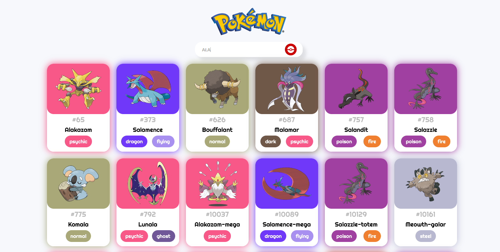

# Sobre o projeto

Este projeto consiste na criação de uma pokedex em react consumindo a [PokeApi](https://pokeapi.co/). O projeto está disponível para acesso [aqui](https://mahteusz-pokedex.netlify.app)


# Tecnologias

- [React](https://pt-br.reactjs.org/)
- [Styled Components](https://styled-components.com/)
- [Axios](https://axios-http.com/ptbr/)

# Layout


# Como rodar este projeto

Para executar este projeto, você precisará de [Git](https://git-scm.com/) e [Node.js](https://nodejs.org/en/) NodeJs Instalado em seu computador.


```console
Clone o repositório
$ git clone https://github.com/mahteusz/react-pokedex.git

Acesse a pasta do projeto no terminal
$ cd react-pokedex

Instale as dependências
$ npm install

Inicialize o app
$ npm start

```
